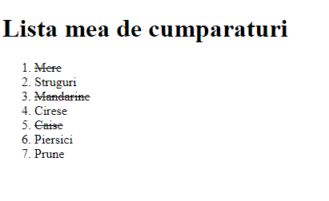

## Elemente de tip lista si elementele lor.

> a se vedea (HTML):
[elemente de tip "ol / li"](http://htmlbook.ru/html/ol),
[elemente de tip "ul / li"](http://htmlbook.ru/html/ol),


---

Listele permit organizarea textului in grupuri sau colectii de date mai mult sau mai putin ordonate. Atunci cand mai multe elemente apartin uneia si aceleiasi liste, intre acestea din punct de vedere semantic exista o conexiune.
Elementele de tip lista sunt utilizate deseori in crearea punctelor de navigare, categoriilor, tag-urilor si multor alte componente ale paginii.

### 1. Shopping List.

Sa presupunem ca urmatorul fragment de cod reprezinta lista de cumparaturi pe care o persoana va trebui sa o indeplineasca.


```html
<!DOCTYPE html>
<html>
<head>
  <meta charset="UTF-8">
  <title>Shopping List</title>
</head>
<body>
  <h1>Lista mea de cumparaturi</h1>
  <ol>
    <li>Mere</li>
    <li>Struguri</li>
    <li>Mandarine</li>
    <li>Cirese</li>
    <li>Caise</li>
  </ol>  
</body>
</html>

```


Sa se efectuieze urmatoarele:
  * Punctele 1,3 si 5 reprezinta produse care au fost deja cumparate, sa se taie textul cu o linie pentru aceste elemente.
  * Sa se adauge inca doua pozitii ***Piersici*** si ***Prune*** la sfarsitul listei.

Rezultatul obtinut ar trebui sa arate ca in imagine.

  

---
