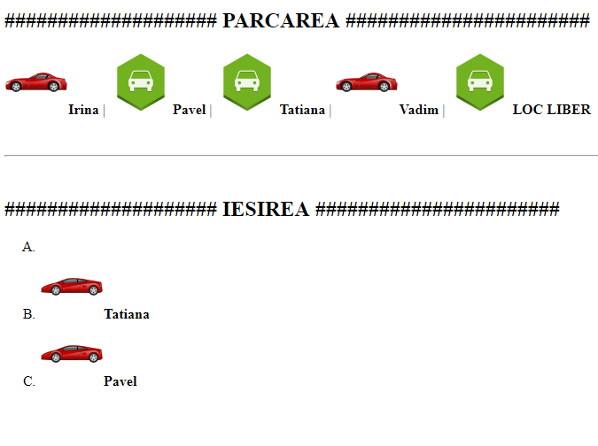

## Elemente de tip lista si elementele lor. Formatarea textului.

> a se vedea (HTML):
[elemente de tip "img"](http://htmlbook.ru/html/img),
[elemente de tip "ul"](http://htmlbook.ru/html/ul),


---

NOTA: Browser-ele de obicei reprezinta toate tipurile de lista aranjand elementele pe verticala! Asa sunt listele stilizate implicit.

### 1.Parking List.

Sa presupunem ca urmatoarea pagina reprezinta o parcare cu 5 locuri de parcare si 3 intrari (A,B,C).


```html
<!DOCTYPE html>
<html>
<head>
  <meta charset="UTF-8">
  <title>Parking List</title>
</head>
<body>
  <h2>#################### PARCAREA #######################</h2>
  <p><b>Irina</b> | <b>Pavel</b> | <b>Tatiana</b> | <b>Vadim</b> | <b>LOC LIBER</b></p>

  <br>
  <hr>
  <br>
  <h2>#################### IESIREA  #######################</h2>
  <ol type="A">
    <li></li>
    <li></li>
    <li></li>
  </ol>
</body>
</html>


```

NOTA: Pentru ca sa va reuseasca sa afisati imaginile din acest exemplu, va recomandam sa creati un dosar (de ex. "parking") in interiorul caruia sa creati fisierul "cars.html" si tot in acel dosar sa descarcati imaginile  si , 
Astfel intr-un final veti obtine urmatoarea structura
* parking/
  - cars.html
  - car-1.png
  - car-2.png
  - car-park-place.png


Sa se efectuieze urmatoarele:
  * Modificati codul HTML astfel incat sa ilustrati situatia cand ***Tatiana*** si ***Pavel*** au parasit locurile lor de parcare.
  * Ilustrati situatia cand ***Tatiana*** se afla la iesirea "B" iar ***Pavel*** la iesirea "C" din parcare.

Rezultatul obtinut ar trebui sa arate ca in imagine.

  

---

NOTA: imaginile utilizate au fost preluate de pe website-ul: [http://www.iconarchive.com/](http://www.iconarchive.com/)
---
