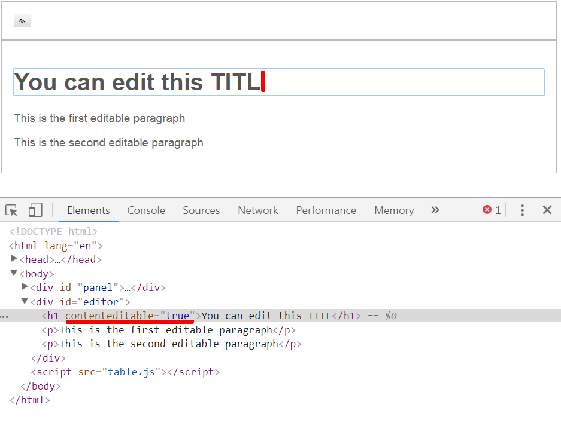

## Componente vizuale pentru backend
> a se vedea (js):
[metoda "getElementById()"](https://www.w3schools.com/jsref/met_document_getelementbyid.asp),
[proprietatile elementelor "contenteditable", "lastElementChild"](https://www.w3schools.com/tags/att_global_contenteditable.asp),
[atributul "children"](https://www.w3schools.com/jsref/prop_element_children.asp),

---


Exista o componenta vizuala care este deseori intalnita in panourile de administrare a multor site-uri care permite redactarea materialelor publicate pe site. Aceasta componenta poarta denumirea de redactor "wysiwyg", sau redactor vizual. Mai sus aveti niste linkuri utile care va demonstreaza cum arata asa gen de redactoare.
Un lucru interesant este tendinta redactoarelor moderne de a permite asa numita redactare "inline" sau i se mai spune "in place editing (IPE)" inseamnand faptul ca textul care urmeaza a fi redactat este prezentat in varianta sa reala - cu stiluri si interactiune cu tot, ia in cazul in care avem nevoie de a face o schimbare, este accesat un buton care activeaza aceasta optiune. Acest IPE a devenit mai accesibil si mai usor de realizat incepand cu HTML5 deoarece permite redactarea direct in elementul real - adica H1, sau P sau practic orice alt element datorita atributului "contenteditable".

Imaginati-va ca elementele aflate in interiorul #editor pot fi transformate in redactabile in cazul in care li se ataseaza atributul "contenteditable". Se cere ca in baza codului oferit in continuare sa face in asa mod incat pentru H1 si P din #editor sa se includa regimul de redactare atunci cand este actionat butonul #btn-edit.

Iata codul-sursa initial

### editor.html

```html

<!DOCTYPE html>
<html lang="en">
<head>
  <meta charset="UTF-8">
  <meta name="viewport" content="width=device-width, initial-scale=1.0">
  <link rel="stylesheet" href="editor.css">
  <title>Example of an IPE</title>
</head>
<body>

  <div id="panel">
    <button id="btn-edit">&#9998;</button>
  </div>
  <div id="editor">
    <h1>You can edit this TITLE</h1>
    <p>This is the first editable paragraph</p>
    <p>This is the second editable paragraph</p>
  </div>

  <script src="editor.js"></script>
</body>
</html>


```

### editor.css

```css
#panel,
#editor{
  border: 1px solid #bbb;
  padding: 20px;
  font-family: Arial, sans-serif;
}

#editor h1{
  font-size: 40px;
  color: #555;
}

#editor p{
  font-size: 19px;
  color: #666;
}


```

### editor.js

```javascript

   function turnEditOn(){
     // algoritmul posibil al functiei:
     // 1) cauta elementul #editor
     // 2) acceseaza printr-un for toate elementele-copil
     // 3) ataseaza fiecarui element-copil atributul "contenteditable" setandu-i valoarea true
   }
   function turnEditOff(){
     // exact acelasi algoritm ca si la functia precedenta doar ca p 3) - "contenteditable" setat in false
   }


```
functia ***turnEditOn()*** va fi apelata cand se face primul click pe butonul de redactare, aceasta cautand si activand regimul de redactare pentru toate elementele din #editor.

Cum verific daca functioneaza regimul de redactare? - simplu, dupa ce activezi atributul "contenteditable" fa un click in browser pe elementul respectiv
ar trebui sa apara un cursor textual care permite schimbarea continutului acestuia.



* BONUS: Adaugati o functie **turnEditOff()** care ar dezactiva regimul de redactare.
* BONUS: Schimbati cumva vizual starea butonului astfel incat sa fie clar cand regimul de redactare este activ sau inactiv.

---
