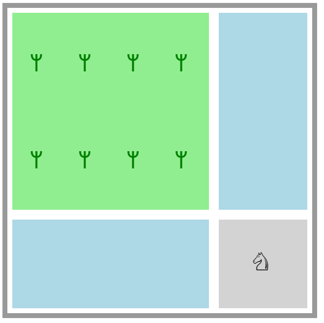

## Блочные элементы или контейнеры.

> изучить (HTML):
[элементы типа "block" ](https://developer.mozilla.org/ro/docs/Web/HTML/Block-level_elements#Block-level_vs._inline),
[модель визуального форматирования](https://html5book.ru/block-inline-elements/#part1),


---

Отображение любого элемента в документе определяется шаблоном поведения, который ему приписывается. Эта модель определяет, как
элемент будет себя вести и взаимодействовать с родительским элементом, соседними элементами и по отношению к собственному содержимому.

Модель поведения блочных или контейнерных элементов характеризуется тем, что они обычно появляются с новой строки и имеют тенденцию занимать все свободное пространство по горизонтали. Высота блочного элемента будет определяться его содержимым, а его ширина будет растягиваться на все свободное пространство родительского элемента.

Важно отметить тот факт, что до тех пор пока размеры блочного элемента не указаны, его ширина будет вычисляться от доступного пространства, уменьшая при этом значения внешнего отступа, рамки и внутреннего отступа.

Типичными блочными элементами, которым присуще подобное поведение, являются ```<h1>-<h6>,<p>,<div>,<ul>,<li>,<header>,<section>,...```.

При работе с такими элементами вам следует представлять, что вы имеете дело с коробкой/контейнером или разделом страницы. Соответственно, следует обратить внимание на следующие моменты:
* Чтобы задать размеры блока можно применять свойства ```width``` и ```height``` в единицах измерения длины. По умолчанию размеры блока находятся в автоматическом режиме ```auto```.
* Чтобы управлять внутренним пространством в любом направлении (внутренний отступ), вы можете использовать свойство ```padding``` в любом из 4 основных направлений ```top,right,bottom,left```.
* Чтобы добавить расстояние между блочными элементами или между блоками и соседними элементами, или отступ от границы родительского элемента, можете применить свойство, управляющее внешним отсупом ```margin``` также в 4 основных направлениях, как и для ```padding```.
* Внимание! значение ```margin``` в вертикальном направлении по умолчанию накладывается/схлопывается с вертикальным ```margin``` родительского элемента или соседнего элемента и применится то значение, которое больше.


Представим, что следующий документ описывает расположение зданий в квартале с парковой зоной и площадью с памятником. На основе нижеприведенного примера дополните код таким образом, чтобы результат соответсвовал изображению.

### 1. Небольшой квартал.
Берем данный код за основу.

```html
<!DOCTYPE html>
<html lang="en">
<head>
  <meta charset="UTF-8">
  <meta name="viewport" content="width=device-width, initial-scale=1.0">
  <meta http-equiv="X-UA-Compatible" content="ie=edge">
  <title>Block Model Example - City</title>
  <style>
    #square{
      width: 600px;
      height: 600px;
      border: 10px solid #999;
      padding: 10px;
    }
    #park{
      width: 400px;
      height: 400px;
      background-color: lightgreen;
      /* ??? */
    }
    #building-1{
      width: 180px;
      height: 400px;
      background-color: lightblue;
      /* ??? */
    }
    #building-2{
      width: 400px;
      height: 180px;
      background-color: lightblue;
      /* ??? */
    }
    #market{
      background-color: lightgrey;
      /*  ???  */
    }
    #market .monument{
      font-size: 50px;
      /* ??? */
    }
    #park .tree{
      font-size: 50px;
      color: green;
      /* ??? */
    }

  </style>
</head>
<body>

  <section id="square">

    <div id="park">
      <div class="tree">&#5848;</div>
      <div class="tree">&#5848;</div>
      <div class="tree">&#5848;</div>
      <div class="tree">&#5848;</div>
      <div class="tree">&#5848;</div>
      <div class="tree">&#5848;</div>
      <div class="tree">&#5848;</div>
      <div class="tree">&#5848;</div>
    </div>
    <div id="building-1"></div>
    <div id="building-2"></div>
    <div id="market">
      <div class="monument">
        &#9816;
      </div>
    </div>

  </section>


</body>
</html>


```

Выполнить следующее:
  * Используя ***margin*** в комбинации с ***padding*** и ***float*** добиться указанного результата.

  


  * Бонус: постарайтесь применить свойство ***border*** в необходимых частях кода таким образом, чтобы результат был как на картинке ниже.

  

---
