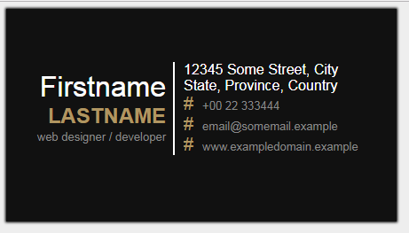

## Работа с блочными элементами.

> изучить (CSS):
[css свойства блочной модели](),


---

Воспроизведите результат, показанный на изображении ниже.


На основе приведенного ниже кода.

### 1. Шаблон визитной карточки.

```html
<!DOCTYPE html>
<html lang="en">
<head>
  <meta charset="UTF-8">
  <meta name="viewport" content="width=device-width, initial-scale=1.0">
  <meta http-equiv="X-UA-Compatible" content="ie=edge">
  <title>Business Card Example</title>
  <style>
    body{
      background-color: #EEE;
    }
    h1,h2,p,ul{
      padding: 0;
      margin: 0;
      list-style: none;
    }
    #business-card{
      background-color: #111;
      width: 400px;
      height: 200px;

      /*  ??? */
    }
    #business-card .name{
     /*  ??? */
    }
    #business-card .info{
      /*  ??? */    
    }
    #business-card .name h1{
      /*  ??? */
    }
    #business-card .name h2{
      /*  ??? */
    }
    #business-card .name small{
      /*  ??? */
    }
    #business-card .info li{
      /*  ??? */
    }
    #business-card .info li:before{
      /*  ??? */
    }


  </style>
</head>
<body>
  <div id="business-card">

    <div class="name">
      <h1>Firstname</h1>
      <h2>Lastname</h2>
      <small>web designer &#47; developer</small>
    </div>
    <div class="info">
      <p>12345 Some Street, City<br>State, Province, Country</p>
       <ul>
         <li>+00 22 333444</li>
         <li>email@somemail.example</li>
         <li>www.exampledomain.example</li>
       </ul>
    </div>

  </div>
</body>
</html>

```


УСЛОВИЯ:
  * Не разрешается изменять код HTML, только CSS!!!

  * Обратите внимание на области кода, отмеченные символом `` / * ??? * / `` в CSS !!!

  * Разрешается применять только следующие свойства CSS: ***border, margin, padding, width, height, box-shadow, background-color, color, font-size, font-family, content, float, font-weight,text-align***

  * БОНУС: Замените символ ```#``` перед контактными данными соответствующими иконками телефона, email-а и земного шара/карты.

---
