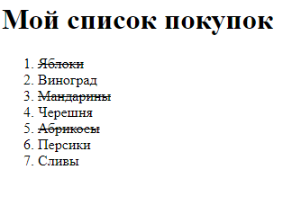

## Списки и элементы списков.

> изучить (HTML):
[элементы типа "ol / li"](http://htmlbook.ru/html/ol),
[элементы типа "ul / li"](http://htmlbook.ru/html/ol),


---

Списки позволяют упорядочить текст по группам или коллекциям данных более или менее упорядоченным способом.
Когда несколько элементов принадлежат к одному и тому же списку, между ними существует семантическая связь.
Элементы списка часто применяются для создания пунктов навигации, категорий, тегов и многих других частей страницы.

### 1. Shopping List.

Предположим, что следующий фрагмент кода - это список покупок, который человек должен будет сделать.

```html
<!DOCTYPE html>
<html>
<head>
  <meta charset="UTF-8">
  <title>Shopping List</title>
</head>
<body>
  <h1>Мой список покупок</h1>
  <ol>
    <li>Яблоки</li>
    <li>Виноград</li>
    <li>Мандарины</li>
    <li>Черешня</li>
    <li>Абрикосы</li>
  </ol>  
</body>
</html>

```

Необходимо выполнить следующее:
   * Пункты 1, 3 и 5 представляют собой уже купленные продукты; текс этих пунктов необходимо перечеркнуть полосой.
   * В конец списка добавить еще два пункта: ***Персики*** и ***Сливы***.

Результат должен выглядеть как показано на изображении.

  

---
