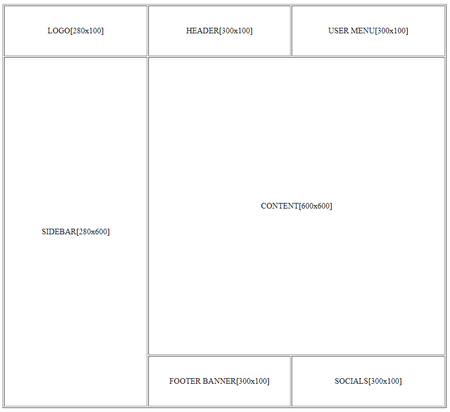

## Элементы таблицы. Принципы макетирования

> изучить (HTML):
[элементы "table"](http://htmlbook.ru/html/table),
[элементы "tr"](http://htmlbook.ru/html/tr),
[элементы "td"](http://htmlbook.ru/html/td),

---

Таблица позволяет организовать пространство упорядоченным образом в горизонтальном и вертикальном направлениях, разделяя его на строки и столбцы. В связи с этим, в течение долгого времени таблицы в HTML использовались для создание макетов (компоновки содержимого на странице).
Несмотря на то, что страницы современных сайтов создаются с использованием новых элементов, многие основные принципы табличных макетов остались.

ПРИМЕЧАНИЕ: для того, чтобы решить эти примеры, вам понадобятся атрибуты ***colspan*** и ***rowspan*** для «table», а также ***width*** и ***height*** для «td».

### 1.Макет простой страницы.

На основе таблицы из 3 строк из 3 ячеек (столбцов), попробуйте создать следующий эскиз макета страницы.
В квадратных скобках указаны размеры в пикселях для каждой ячейки. Конечные размеры таблицы «880» в ширину и «800» в высоту.
Правильный результат показан на рисунке ниже.

ПРИМЕЧАНИЕ. Текст в каждой ячейке указывает цель, для которой эта ячейка была создана в будущем макете.
ПРИМЕЧАНИЕ. Макет, созданный таким образом, является ***фиксированным*** и из-за того, что значения, указаны в пикселях, его размеры не меняются при изменении размеров окна.
