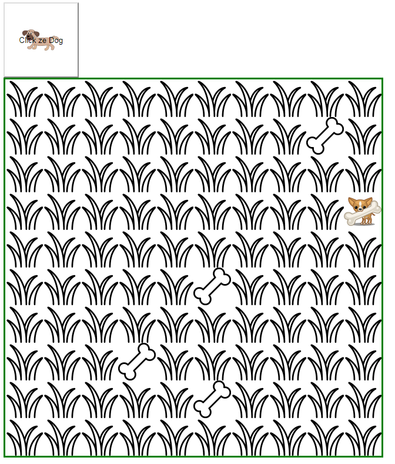

## Простое взаимодействие с элементами документа
> изучить (js):
[метод "getElementsByClassName()"](https://developer.mozilla.org/ro/docs/Web/API/Document/getElementsByClassName),
[метод "querySelector()"](https://developer.mozilla.org/ro/docs/Web/API/Document/querySelector),
[атрибуты ".className" si ".classList"](https://developer.mozilla.org/ro/docs/Web/API/Element/className),
[атрибуты ".innerHTML" ](https://developer.mozilla.org/ro/docs/Web/API/Element/innerHTML),

---

Создайте следующие файлы и сделайте небольшую игру, где главный герой щенок «Пиструшка» пытается отыскать все кости в саду. Идея игры следующая: каждый раз, когда пользователь нажимает на кнопку с изображением щенка, он ищет следующую спрятанную в саду кость, класс «bone». Найденная кость окрашивается в соответствии с изменением ее класса. Как показано на рисунке ниже



Файлы с исходным кодом, с которых вам нужно будет начать разработку игры

### game.html

```html
<!DOCTYPE html>
<html lang="en">
<head>
  <meta charset="UTF-8">
  <meta name="viewport" content="width=device-width, initial-scale=1.0">
  <meta http-equiv="X-UA-Compatible" content="ie=edge">
  <link rel="stylesheet" href="game.css">
  <title>Document</title>
</head>
<body>

  <button>Click ze Dog</button>
  <div id="yard">
    <div class="grass"></div>
    <div class="grass"></div>
    <div class="grass"></div>
    <div class="grass"></div>
    <div class="grass"></div>
    <div class="grass"></div>
    <div class="grass"></div>
    <div class="grass"></div>
    <div class="grass"></div>
    <div class="grass"></div>
    <div class="grass"></div>
    <div class="grass"></div>
    <div class="grass"></div>
    <div class="grass"></div>
    <div class="grass"></div>
    <div class="grass"></div>
    <div class="grass"></div>
    <div class="grass"></div>
    <div class="bone"></div>
    <div class="grass"></div>
    <div class="grass"></div>
    <div class="grass"></div>
    <div class="grass"></div>
    <div class="grass"></div>
    <div class="grass"></div>
    <div class="grass"></div>
    <div class="grass"></div>
    <div class="grass"></div>
    <div class="grass"></div>
    <div class="grass"></div>
    <div class="grass"></div>
    <div class="grass"></div>
    <div class="grass"></div>
    <div class="grass"></div>
    <div class="grass"></div>
    <div class="grass"></div>
    <div class="grass"></div>
    <div class="grass"></div>
    <div class="grass"></div>
    <div class="bone-found"></div>
    <div class="grass"></div>
    <div class="grass"></div>
    <div class="grass"></div>
    <div class="grass"></div>
    <div class="grass"></div>
    <div class="grass"></div>
    <div class="grass"></div>
    <div class="grass"></div>
    <div class="grass"></div>
    <div class="grass"></div>
    <div class="grass"></div>
    <div class="grass"></div>
    <div class="grass"></div>
    <div class="grass"></div>
    <div class="grass"></div>
    <div class="bone"></div>
    <div class="grass"></div>
    <div class="grass"></div>
    <div class="grass"></div>
    <div class="grass"></div>
    <div class="grass"></div>
    <div class="grass"></div>
    <div class="grass"></div>
    <div class="grass"></div>
    <div class="grass"></div>
    <div class="grass"></div>
    <div class="grass"></div>
    <div class="grass"></div>
    <div class="grass"></div>
    <div class="grass"></div>
    <div class="grass"></div>
    <div class="grass"></div>
    <div class="grass"></div>
    <div class="bone"></div>
    <div class="grass"></div>
    <div class="grass"></div>
    <div class="grass"></div>
    <div class="grass"></div>
    <div class="grass"></div>
    <div class="grass"></div>
    <div class="grass"></div>
    <div class="grass"></div>
    <div class="grass"></div>
    <div class="grass"></div>
    <div class="grass"></div>
    <div class="bone"></div>
    <div class="grass"></div>
    <div class="grass"></div>
    <div class="grass"></div>
    <div class="grass"></div>
    <div class="grass"></div>
    <div class="grass"></div>
    <div class="grass"></div>
    <div class="grass"></div>
    <div class="grass"></div>
    <div class="grass"></div>
    <div class="grass"></div>
    <div class="grass"></div>
    <div class="grass"></div>
    <div class="grass"></div>
  </div>

  <script src="game.js"></script>
</body>
</html>


```

### game.css

```css
#yard{
  border:3px solid green;
  width:640px;
  height: 640px;
}
#yard div{
  width: 64px;
  height: 64px;
  float:left;
}
#yard .grass{
  background: url(./grass.png);
}
#yard .bone{
  background: url(./bone.png);
}
#yard .bone-found{
  background: url(./bone-found.png);
}

button{
  background: url(./dog.png) no-repeat center;
  width: 128px;
  height: 128px;
}


```

### game.js

```javascript

   function findNextBone(){
     // Алгоритм функции:
     // * найти первый "div" с классом "bone" можно использовать querySelector() или getElementsByClassName()
     // * поменять класс данного элемента - в случае, если был найден, на "bone-found"
     // * внимание!!! в случае когда элемент не найден querySelector() возвращает null, а getElementsByClassName() возвращает коллекцию с 0 (ноль) элементов, свойство .length
     // * в случае, если костей для поиска не осталось, вывести сообщение "GAME OVER", который заменит все элементы DIV внутри «#yard», можете использовать свойство .innerHTML
   }
```
Данная функция должна реагировать на каждое нажатие на кнопку со щенком.

* БОНУС: используя ```javascript Math.random()``` постарайтесь добиться того, чтобы при каждой загрузке документа, кости размещались на карте в произвольном порядке.

---
