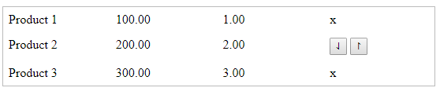

## Простое взаимодействие с элементами документа
> изучить (js):
[метод "getElementById()"](https://www.w3schools.com/jsref/met_win_alert.asp),
[свойства "parentElement", "firstElementChild", "children", "lastElementChild"](https://www.w3schools.com/jsref/prop_node_parentelement.asp),
[атрибуты "onclick"](https://www.w3schools.com/jsref/event_onclick.asp),

---

Один из часто присутствующих визуальных компонентов который используется для того чтобы переместить строку (запись) в таблице данных в верх и в низ состоит из двух кнопок каждая из которых может сместить строку на один ряд в ту или иную сторону.

Напишите функционал который приведет в действие данные кнопки на основе следующих файлов, так чтобы при нажатии на кнопки продукт 2 менялся местами с 1-ым или 3-ем.

### table.html

```html
<!DOCTYPE html>
<html lang="en">
<head>
  <meta charset="UTF-8">
  <meta name="viewport" content="width=device-width, initial-scale=1.0">
  <link rel="stylesheet" href="table.css">
  <title>Document</title>
</head>
<body>

  <div id="table">
    <div class="row">
      <div class="name">Product 1</div>
      <div class="price">100.00</div>
      <div class="quantity">1.00</div>
      <div class="operations">
        x
      </div>
    </div>
    <div class="row">
      <div class="name">Product 2</div>
      <div class="price">200.00</div>
      <div class="quantity">2.00</div>
      <div class="operations">
        <button>&#8643;</button>
        <button>&#8638;</button>
      </div>
    </div>
    <div class="row">
      <div class="name">Product 3</div>
      <div class="price">300.00</div>
      <div class="quantity">3.00</div>
      <div class="operations">
        x
      </div>
    </div>
  </div>

  <script src="table.js"></script>
</body>
</html>


```

### table.css

```css
#table{
  border: 1px solid #bbb;
}

#table .row{
  padding: 2px;
}

#table .row::after{
  content:"";
  clear: both;
  display: block;
}

#table .name,
#table .price,
#table .quantity,
#table .operations{
  float: left;
  padding: 5px;
  width: 25%;
  box-sizing: border-box;
}


```

### table.js

```javascript

   function moveOneUp(){
     // возможный алгоритм:
     // 1) найти строку где продукт 1
     // 2) найти строку где продукт 2
     // 3) улалить строку 2 но запомнить ее в переменую
     // 4) добавить 2 строку из переменной в начало родительской таблицы
   }
   function moveOneDown(){
     // тот же алг. что и в пред. функции только с продуктами 2 и 3
   }


```
Эти две функции реагируют на нажатие на кнопки вверх и вниз



* BONUS: Создать функцию **showProducts()** которая наполняла бы таблицу из массива ```array``` с данными о продуктах.

---
